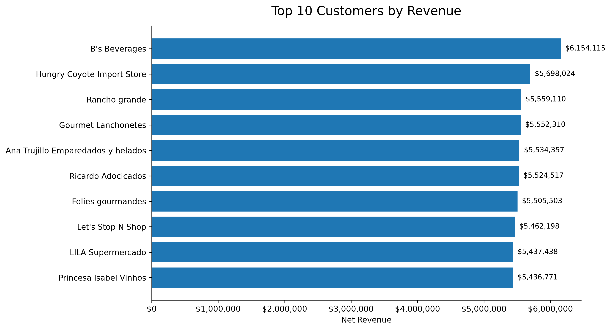
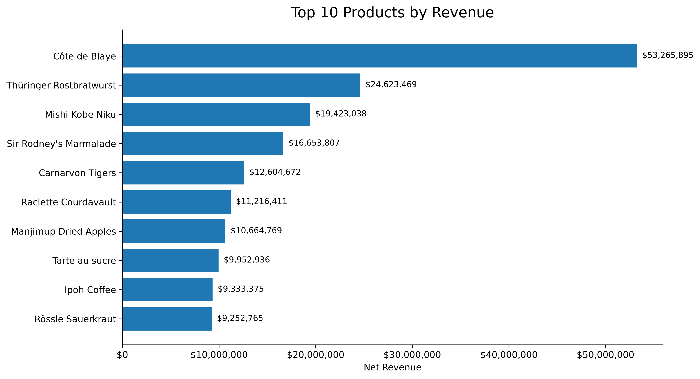
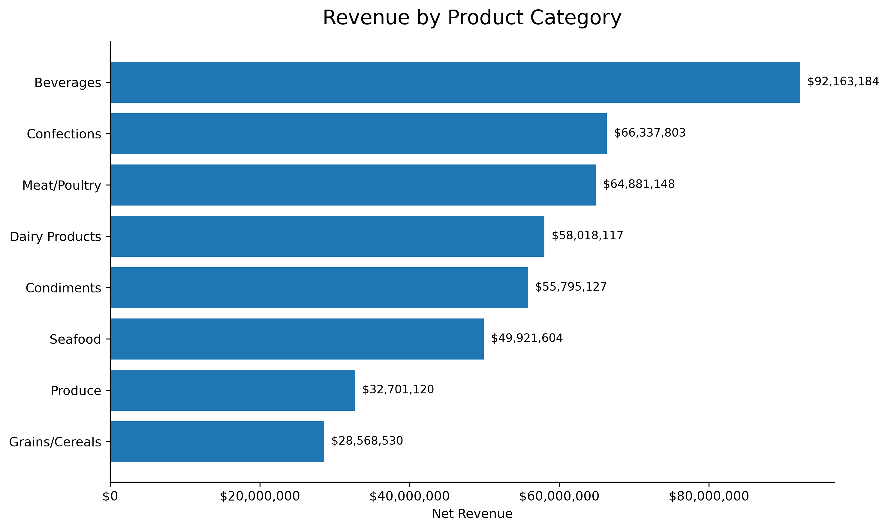
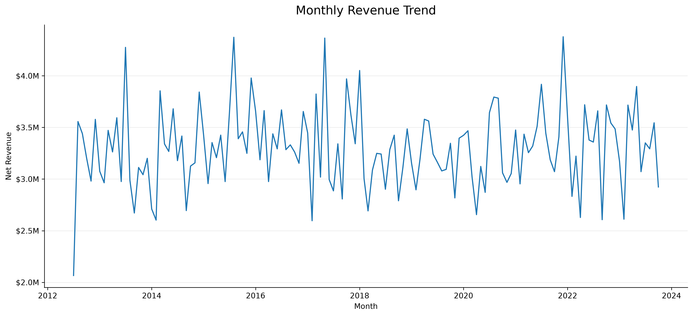
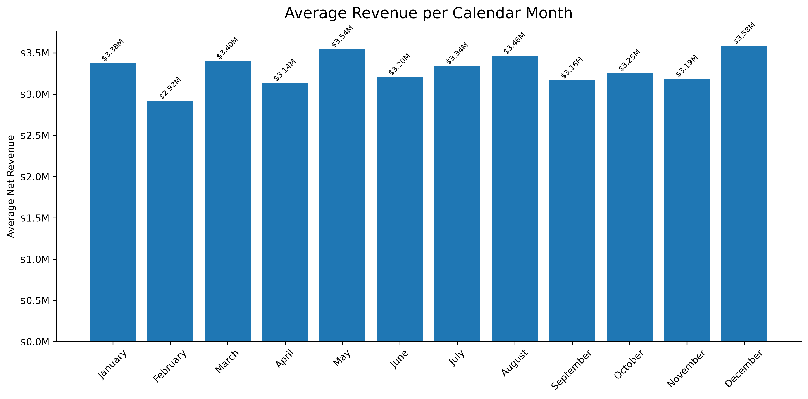

# 📊 SQL Business Analysis with Northwind Database

## Project 03 – Data Analytics & Business Intelligence Portfolio


---

## 📌 Project Overview

This project presents a **business-oriented SQL analysis** of the Northwind database, designed to transform transactional data into meaningful business insights.

Rather than treating SQL as a collection of isolated exercises, the project is structured around practical analytical questions related to:

- Customer performance
- Product performance
- Product categories
- Revenue contribution
- Sales trends
- Seasonality
- Business KPIs

Each analytical workflow follows a business-oriented structure:

**Business Question → SQL Query → Finding → Interpretation → Business Value**

The objective is to demonstrate how SQL can be used as an analytical tool to support **data-driven business decision-making**.

---

## 🎯 Business Questions

The analysis was designed to answer questions such as:

- Which customers generate the highest revenue?
- Which products generate the highest revenue?
- Which products sell the largest number of units?
- Which product categories contribute the most to total revenue?
- How concentrated is revenue across customers and products?
- How does revenue evolve over time?
- Which months generate the strongest sales performance?
- Are there recurring seasonal patterns in the business?
- How can transactional data be transformed into actionable business insights?

---

## 🛠 Technologies & Skills

- SQL
- SQLite
- Python
- Pandas
- Matplotlib
- Jupyter Notebook
- Data Analysis
- Business Intelligence
- Data Aggregation
- Table Joins
- Common Table Expressions (CTEs)
- Window Functions
- CASE Expressions
- Date Functions
- NULL Handling
- KPI Analysis
- Revenue Analytics
- Time-Series Analysis
- Percentage Calculations
- Business Reporting
- Data Visualization
- Analytical Storytelling

---

## 🗄️ Dataset

**Database:** Northwind

Northwind is Microsoft's classic sample database representing the operations of an international trading company.

The database includes information about:

- Customers
- Orders
- Order Details
- Products
- Categories
- Employees
- Suppliers
- Shippers

These relational tables make it possible to analyze the company from multiple business perspectives using SQL joins, aggregations, and analytical calculations.

---

## 📈 Business Analysis

### 👥 Customer Analysis

The customer analysis identifies the accounts generating the greatest contribution to company revenue.

Key questions include:

- Which customers generate the highest revenue?
- How concentrated is revenue among the largest customers?
- Does the company depend heavily on a small number of accounts?

The analysis shows that **B's Beverages is the highest-revenue customer**, while revenue among the leading customers remains relatively distributed rather than being dominated by a single account.



---

### 📦 Product Analysis

Product-level analysis evaluates which products generate the greatest commercial impact.

The analysis includes:

- Revenue by product
- Units sold
- Product rankings
- Contribution to company sales

The ranking highlights the products responsible for the largest contribution to total net revenue after discounts.



---

### 🗂️ Category Analysis

Product categories were analyzed from several perspectives:

- Total revenue
- Sales volume
- Product portfolio size
- Revenue contribution
- Average revenue per product

**Beverages is the highest-revenue category**, representing approximately **20.55% of total company revenue**.

Despite its leading position, revenue remains relatively balanced across the main product categories.



---

### 📅 Sales Trend Analysis

Time-based analysis was performed to understand how company revenue evolves throughout the available sales history.

The analysis includes:

- Annual revenue
- Monthly revenue
- Quarterly performance
- Peak revenue periods
- Average revenue by calendar month
- Seasonal patterns

Monthly revenue remains relatively stable across much of the available history, although several periods show stronger sales performance.

The first and final years contain partial data and should therefore be interpreted carefully when making year-over-year comparisons.



---

### 🗓️ Seasonal Analysis

Average revenue was calculated by calendar month to identify recurring seasonal patterns.

**December records the highest average monthly revenue**, while **February records the lowest**.

This suggests a moderate seasonal pattern, with stronger commercial performance toward the end of the year.



---

## 🧠 SQL Concepts Applied

The project demonstrates practical use of SQL concepts commonly required in Data Analytics and Business Intelligence roles.

### Data Retrieval & Filtering

- SELECT statements
- WHERE conditions
- ORDER BY
- Filtering and sorting

### Data Aggregation

- SUM
- AVG
- COUNT
- GROUP BY
- Percentage calculations
- Business KPI calculations

### Relational Analysis

- INNER JOIN
- LEFT JOIN
- Multi-table queries

### Advanced SQL

- Common Table Expressions (CTEs)
- Window Functions
- CASE expressions
- Date functions
- NULL handling
- Ranking calculations
- Multi-level aggregations

### Business Analytics

- Revenue analysis
- Customer ranking
- Product ranking
- Category contribution
- Time-series analysis
- Seasonal analysis
- KPI reporting

---

## 📊 Data Visualization

SQL query results were imported into **Python using Pandas** and visualized with **Matplotlib**.

This creates a workflow combining:

**Relational Database → SQL Analysis → Python → Visualization → Business Insight**

The visualizations allow query results to be communicated more effectively to non-technical stakeholders and provide additional context for business interpretation.

---

## 💡 Key Business Insights

The analysis reveals several important patterns in the Northwind business:

- Revenue is distributed across multiple major customers rather than being overwhelmingly dependent on a single account.
- B's Beverages represents the highest-revenue customer in the analyzed dataset.
- Product revenue is concentrated among a group of leading products.
- Beverages is the strongest product category, contributing approximately **20.55% of total revenue**.
- Revenue distribution across major categories remains relatively diversified.
- Monthly revenue shows recurring fluctuations rather than a constant linear trend.
- December produces the highest average revenue among calendar months.
- February records the lowest average monthly revenue.
- The data suggests moderate seasonality, with stronger performance toward the end of the year.
- Partial years should not be compared directly with complete years without controlling for the available observation period.

These findings demonstrate how SQL analysis can move beyond data extraction and support **commercial performance evaluation and business decision-making**.

---

## 📂 Project Structure

```text
Project_03_SQL_Business_Analysis/
│
├── database/
│
├── queries/
│   ├── 01_learning/
│   └── 02_business_questions/
│       ├── 01_top_customers.sql
│       ├── 02_product_performance.sql
│       ├── 03_category_analysis.sql
│       └── 04_sales_trends.sql
│
├── notebooks/
├── images/
├── README.md
├── projects_notes.md
├── requirements.txt
└── .gitignore
```

---

## 🚀 How to Use

1. Clone the repository.
2. Open the project in Visual Studio Code.
3. Open the Northwind SQLite database.
4. Execute the SQL scripts located in:

```text
queries/02_business_questions/
```

The business-oriented SQL files are structured around:

- Business Question
- SQL Solution
- Finding
- Interpretation
- Business Value

The visualization notebook can then be used to transform SQL outputs into charts for analytical reporting.

---

## 🚀 Project Outcome

This project demonstrates the development of a complete **SQL-based business analysis workflow**, from relational database exploration and query development to KPI analysis, visualization, interpretation, and business reporting.

The project demonstrates practical skills in:

- SQL querying
- Relational database analysis
- Multi-table joins
- Data aggregation
- CTEs
- Window functions
- KPI calculations
- Customer analysis
- Product analysis
- Revenue analysis
- Time-series analysis
- Seasonal analysis
- Python-based visualization
- Business insight generation
- Analytical storytelling

Most importantly, the project demonstrates the ability to use **SQL to answer real business questions rather than simply retrieve data**.

As **Project 03** of the portfolio, it expands the analytical foundation developed in Projects 01 and 02 by introducing a stronger focus on **relational databases, SQL analytics, and Business Intelligence**.

---

## 👨‍💻 Author

**Martin Panelo**

**Data Analyst | Geophysicist | Scientific Computing**

Analytical professional combining data analytics, scientific computing, and geoscience experience, with a focus on Python, SQL, Power BI, data visualization, and business-oriented problem solving.

- GitHub: [PaneloMartin](https://github.com/PaneloMartin)
- LinkedIn: [Martin Panelo](https://www.linkedin.com/in/martinpanelo/)